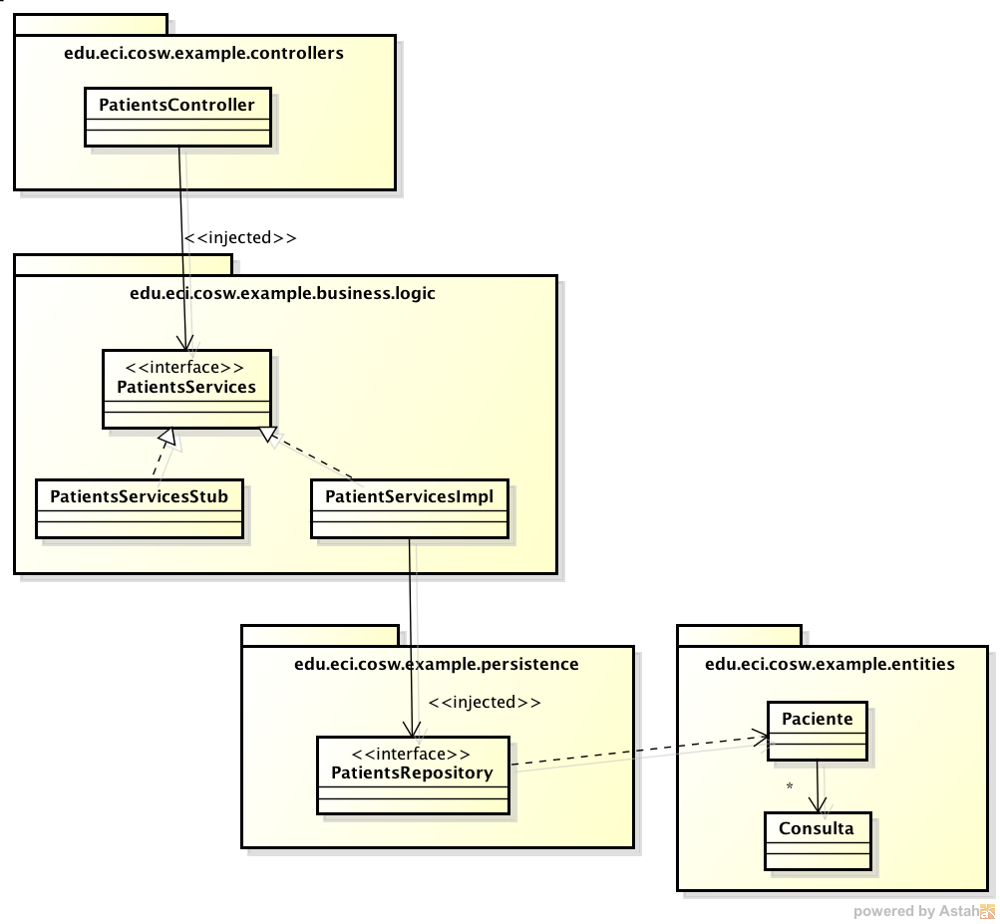

###Escuela Colombiana de Ingeniería
###Construcción de Software - COSW


####Frameworks ORM-Frameworks de persistencia-Spring Data

En este ejercicio se va a habilitar la capa de persistencia de un API rest, el cual, aunque funciona, sólo reporta datos estáticos generados en la capa lógica. Al finalizar este ejercicio, se espera tener:

* Una capa de persistencia para la aplicación.
* Una capa lógica a la que se le inyecte dicha capa de persistencia, y que con la misma implemente las funcionalidades que le compenten.
* Un esquema de pruebas que haga uso de una base de datos 'volatil'.

El siguiente, es el modelo completo, en el que se considera el principio de inversión de dependencias (DiP), de manera que el controlador del API REST NO está fuertemente acoplado con el mecanismo de obtención de los datos que éste ofrece:




Realice lo siguiente, teniendo en cuenta la conveción de paquetes del diagrama anterior:

1. Agregue las siguientes dependencias a su proyecto (driver de la base de datos H2, base de datos MySQL y Spring-Boot-Data):

	```xml
        <dependency>
            <groupId>com.h2database</groupId>
            <artifactId>h2</artifactId>
            <scope>runtime</scope>
        </dependency>

        <dependency>
            <groupId>org.springframework.boot</groupId>
            <artifactId>spring-boot-starter-data-jpa</artifactId>
        </dependency>
        
        <dependency>
            <groupId>mysql</groupId>
            <artifactId>mysql-connector-java</artifactId>
            <version>5.1.38</version>
        </dependency>
	```


2. Cree la interfaz 'PatientsRepository', la cual hereda de la interfaz CrudRepository, y que asocie a los tipos genéricos Paciente y PacienteID (el tipo del repositorio y el tipo de su llave primaria respectivamente).

	```java
public interface PatientsRepository extends JpaRepository<Paciente, PacienteId>
```

3. Agregue las anotaciones a la clase que tiene la anotación @SpringBootApplication: @EnableJpaRepositories y @EntityScan. En la primera, debe agregar como valor el paquete en el cual agregó la interfaz 'repositorio' creada anteriormente. En la segunda, agregue como valor el paquete donde están las clases de tipo entidad (@Entity). Por ejemplo:

	```java
@EnableJpaRepositories("edu.eci.cosw.paquete1.paquete2.paquete3")
@EntityScan("edu.eci.cosw.jpa.paquete1.paquete2.paquete3")
```


4. En la ruta __src/main/resources__ cree dos archivos de configuración. El primero, tendrá los parámetros para conectarse a una base de datos real, y el segundo, para conectarse a una base de datos H2 en memoria:


	**application.properties**

	```	
	#Database connection parameters
	spring.datasource.url = jdbc:mysql://desarrollo.is.escuelaing.edu.co:3306/bdprueba
	spring.datasource.username = bdprueba
	spring.datasource.password = bdprueba
		
	#Hibernate target database parameters
	spring.jpa.properties.hibernate.dialect = org.hibernate.dialect.MySQLDialect
	spring.jpa.hibernate.naming_strategy=org.hibernate.cfg.EJB3NamingStrategy
		
	#Logging configuration
	spring.jpa.show-sql = true
	logging.level.org.hibernate.SQL=DEBUG
	logging.level.org.hibernate.type.descriptor.sql.BasicBinder=TRACE
```

	**application-test.properties**

	```
	#Database connection parameters
	spring.datasource.url = jdbc:h2:mem:test;DB_CLOSE_ON_EXIT=FALSE
	
	#Automatic tables generation from annotated entities
	spring.jpa.hibernate.hbm2ddl.auto=create
	
	#Hibernate target database parameters
	spring.jpa.properties.hibernate.dialect = org.hibernate.dialect.H2Dialect
	spring.jpa.hibernate.naming_strategy=org.hibernate.cfg.EJB3NamingStrategy
	
	#Logging configuration
	spring.jpa.show-sql = true
	logging.level.org.hibernate.SQL=DEBUG
	logging.level.org.hibernate.type.descriptor.sql.BasicBinder=TRACE
	```

5. Implemente la clase PatientServicesImpl (la cual implementa la interfaz PatientServices). Haga que en ésta se inyecte algo de tipo PatientsRepository, y que con dicho repositorio inyectado, implemente los dos métodos:
	* Para el primer método, revise qué operaciones ofrecen por defecto los [JpaRepository](http://docs.spring.io/spring-data/jpa/docs/current/api/org/springframework/data/jpa/repository/JpaRepository.html).
	* Para el segundo, revise en la sección 2.3.4 de la documentación de [Spring DATA](http://docs.spring.io/spring-data/jpa/docs/1.4.3.RELEASE/reference/html/jpa.repositories.html) cómo definir consultas personalizadas dentro de un repositorio. Puede serle útil tambien la sección 14.10 el uso de 'size' en el [manual de referencia del lenguaje de consulta HQL](https://docs.jboss.org/hibernate/orm/3.3/reference/en/html/queryhql.html). 
	* Con lo anterior, agregue una consulta que permita obtener los pacientes que tengan al menos N consultas, y úsela desde el método que está implementando.

6. Haga que el bean PatientsController se inyecte la clase anteriorme creada (en lugar de la inyectada actualmente, PatientServicesStub).

7. Agregue al API REST un recurso que corresponda a los pacientes que hayan tenido al menos 10 consultas. Implemente el método de controlador correspondiente haciendo uso de los Servicios de Paciente.

8. Rectifique el funcionamiento del API haciedo peticiones GET al mismo a través de un browser.

9. Ahora, va a implementar una prueba para cada uno de los métodos de la lógica (servicios). Para esto, haga que la prueba JUnit (SpringDataRestApiApplicationTests) haga uso del archivo de configuración que hace referencia a la base de datos H2 (application-**test**.properties). Para esto, agregue la anotación  @ActiveProfiles("**test**") en la clase de la prueba.

9. Para implementar la prueba, haga en en la clase JUnit se inyecten tanto los servicios de paciente y el repositorio de pacientes. Realice las siguientes pruebas, haciendo uso del 'repositorio' para agregar los datos iniciales, y de los servicios para hacer las consultas:


	| Método | Clase de equivalencia        | Prueba           | 
|-----| ------------- |:-------------:| 
| getPatient(id,tipoid)| Consulta a paciente que existe      | Registrar un paciente, consultarlo a través de los servcios, y rectificar que sea el mismo | 
| getPatient(id,tipoid)| Consulta a paciente que no existe      | Consultar a través de los servicios un paciente no registrado, y esperar que se produzca el error | 
| topPatients(N)| No existen pacientes con N o más consultas      | Registrar un paciente con sólo 1 consulta. Probar usando N=2 como parámetro y esperar una lista vacía.     | 
| topPatients(N)| Registrar 3 pacientes. Uno sin consultas, otro con una, y el último con dos consultas. Probar usando N=1  y esperar una lista con los dos pacientes correspondientes.| centered      | 

10. Rectifique el resultado de las pruebas mediante

	```
	mvn test
```


11. Finalmente, configure su aplicación para que pueda generar documentación de sí misma, incluyendo -entre otros-: cubrimiento de pruebas y análisis estático de código. Para hacer esto, agregue el siguiente elemento en el pom.xml, como elemento hijo de <project>:

	```
	<reporting>
		<plugins>
			<plugin>
				<groupId>org.apache.maven.plugins</groupId>
				<artifactId>maven-pmd-plugin</artifactId>
			</plugin>
			<plugin>
				<groupId>org.apache.maven.plugins</groupId>
				<artifactId>maven-jxr-plugin</artifactId>
			</plugin>
			<plugin>
				<groupId>org.apache.maven.plugins</groupId>
				<artifactId>maven-javadoc-plugin</artifactId>
			</plugin>
                        
			<plugin>
				<groupId>org.codehaus.mojo</groupId>
				<artifactId>cobertura-maven-plugin</artifactId>
			</plugin>		
		</plugins>
	</reporting>
	```

12. Para generar la documentación, ejecute:

	```
	mvn site
```
	Y consulte la página generada en el directorio  __target/site__

